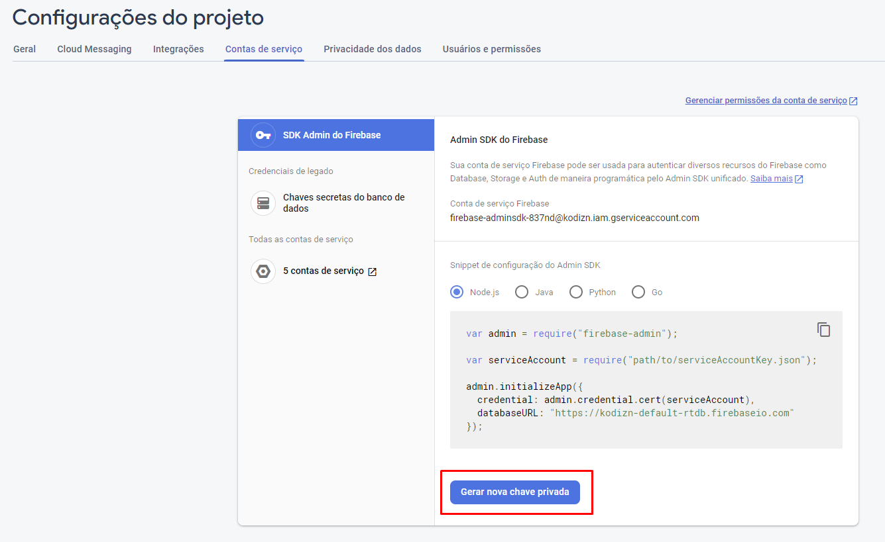

## Realtime Database Action

This action allows you to perform basic read and write operations on a firebase realtime database. Since the realtime database is reactive to changes and connected clients receive changes when those changes happen, this action can help notify an application when a deployment process has ended.

I made this action precisely with that in mind, because in the company we use the realtime database to control the version number of the application that is available and when the version is modified, the connected clients receive a popup notifying the need for an update.

### Inputs

The inputs of this action receive the service account properties that you get in your project settings in the firebase console.



There you also get the URL of your database.

> **Remembering that this configuration will turn your action into admin of your project, so save your service account settings in secrets to keep your project safe.**

```yml
  project_id:
    description: 'Project id'
    required: true
  private_key_id:
    description: 'Private Key Id'
    required: true
  private_key:
    description: 'Private Key'
    required: true
  client_email:
    description: 'Client Email'
    required: true
  client_id:
    description: 'Client Id'
    required: true
  auth_uri:
    description: 'Auth URI'
    required: true
  token_uri:
    description: 'Token URI'
    required: true
  auth_provider_x509_cert_url:
    description: 'Auth Provider x509 Cert URL'
    required: true
  client_x509_cert_url:
    description: 'Client x509 Cert URL'
    required: true
  database_default_url:
    description: 'URL to connect in default database'
    required: true
  reference:
    description: 'Reference to access in database'
    required: true
  operation:
    description: 'The operation to be performed, which can be get or set'
    required: true
  data:
    description: 'New data that will be used to update the reference'
```
